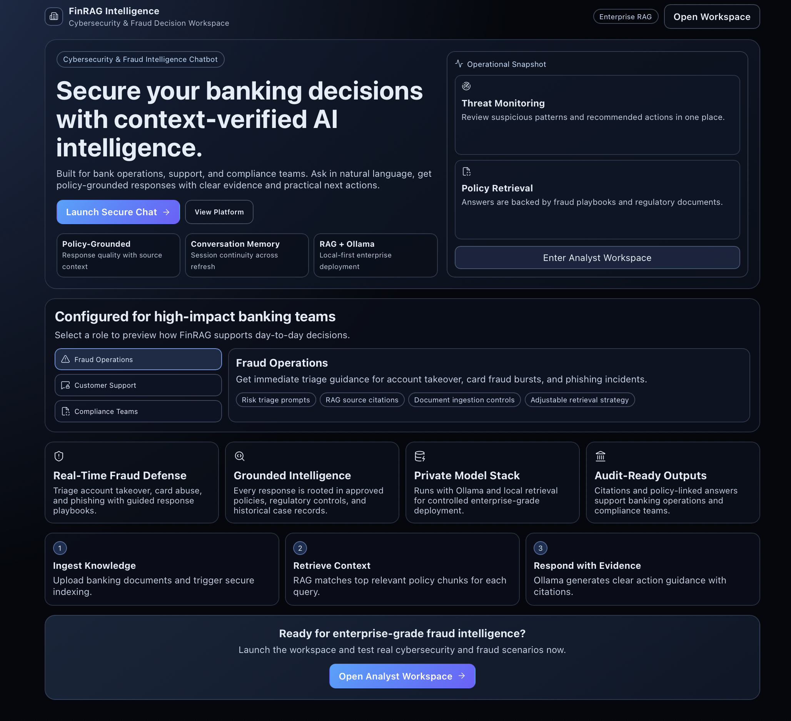
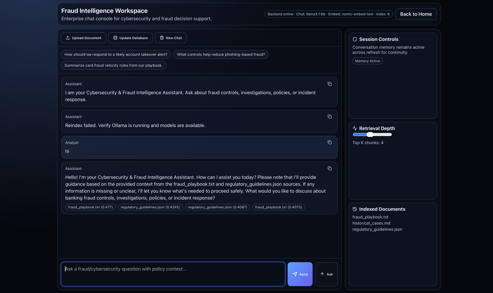

# FinRAG Intelligence

An enterprise-style **Cybersecurity & Fraud Intelligence Chatbot** for banking, built with:
- **Frontend:** React + Vite
- **Backend:** FastAPI (Python)
- **AI stack:** Ollama (LLM + embeddings)
- **Retrieval:** Local RAG pipeline over trusted banking documents

FinRAG helps bank employees and support teams ask security/fraud questions and receive grounded answers with citations from approved internal knowledge sources.

---

## Screenshots

> Add your screenshots in a folder named `screenshots/` at the project root.

### Landing Page


### Chat Workspace


---

## Key Features

### Enterprise UI
- Modern, enterprise-style landing page
- Professional chat workspace UI
- Guided prompt starters for faster usage
- Retrieval depth slider for response control

### Chat Capabilities
- Context-aware AI responses
- Citation display (source + similarity score)
- Chat memory persistence (stored in browser local storage)
- New Chat reset option

### Knowledge Operations
- Upload new policy/rule/case documents from chat area
- Update database (reindex) on demand
- Live backend health and model status visibility

### RAG + Ollama Backend
- Document ingestion (`.txt`, `.md`, `.json`, `.pdf`)
- Chunking + embedding generation
- Vector index stored locally
- Retrieval + answer generation pipeline

---

## Project Structure

```bash
FinRAG_Intelligence/
├── backend/
│   ├── app/
│   │   ├── config.py
│   │   ├── main.py
│   │   ├── ollama_client.py
│   │   ├── rag_service.py
│   │   └── schemas.py
│   ├── data/                  # Banking fraud/cyber knowledge files
│   ├── scripts/
│   │   └── reindex.py
│   ├── store/                 # Generated vector index storage
│   ├── requirements.txt
│   └── server.py
├── frontend/
│   ├── src/
│   │   ├── pages/
│   │   │   ├── LandingPage.jsx
│   │   │   └── ChatPage.jsx
│   │   ├── lib/
│   │   │   └── api.js
│   │   ├── App.jsx
│   │   └── index.css
│   └── package.json
└── README.md
```

---

## How It Works (User Flow)

1. User opens Landing Page and enters chat workspace.
2. User asks fraud/cybersecurity question.
3. Backend retrieves relevant document chunks from indexed data.
4. Ollama generates answer using retrieved context.
5. UI shows final answer + citations.
6. User can upload new document and click **Update Database** to include it in future responses.

---

## Backend Setup (Python + FastAPI)

### 1) Go to backend
```bash
cd backend
```

### 2) Create and activate virtual environment
```bash
python3 -m venv .venv
source .venv/bin/activate
```

### 3) Install dependencies
```bash
pip install -r requirements.txt
```

### 4) Environment file
```bash
cp .env.example .env
```

### 5) Start Ollama and pull models
In a separate terminal:
```bash
ollama serve
```

Then pull models (once):
```bash
ollama pull llama3.1:8b
ollama pull nomic-embed-text
```

### 6) Index RAG data
```bash
python scripts/reindex.py
```

### 7) Run backend
```bash
python server.py
```

Backend URLs:
- API health: `http://localhost:8000/health`
- API docs: `http://localhost:8000/docs`

---

## Frontend Setup (React + Vite)

### 1) Go to frontend
```bash
cd frontend
```

### 2) Install packages
```bash
npm install
```

### 3) Run app
```bash
npm run dev
```

Frontend URL:
- `http://localhost:5173`

---

## API Endpoints

- `GET /health` – backend and model status
- `GET /api/documents` – list indexed/uploaded documents
- `POST /api/upload` – upload file into data store
- `POST /api/ingest` – rebuild index from data folder
- `POST /api/chat` – ask question with history + retrieval

---

## Supported Document Types

- `.txt`
- `.md`
- `.json`
- `.pdf`

---

## Notes

- Keep Ollama running before chat requests.
- Reindex whenever new documents are added.
- If Python environment differs, use your active interpreter path consistently.

---

## Future Improvements

- User authentication and role-based access
- Vector DB integration (FAISS/Chroma/Pinecone)
- Multi-tenant document partitioning
- Conversation export and audit logs
- Evaluation dashboard for answer quality and retrieval metrics
